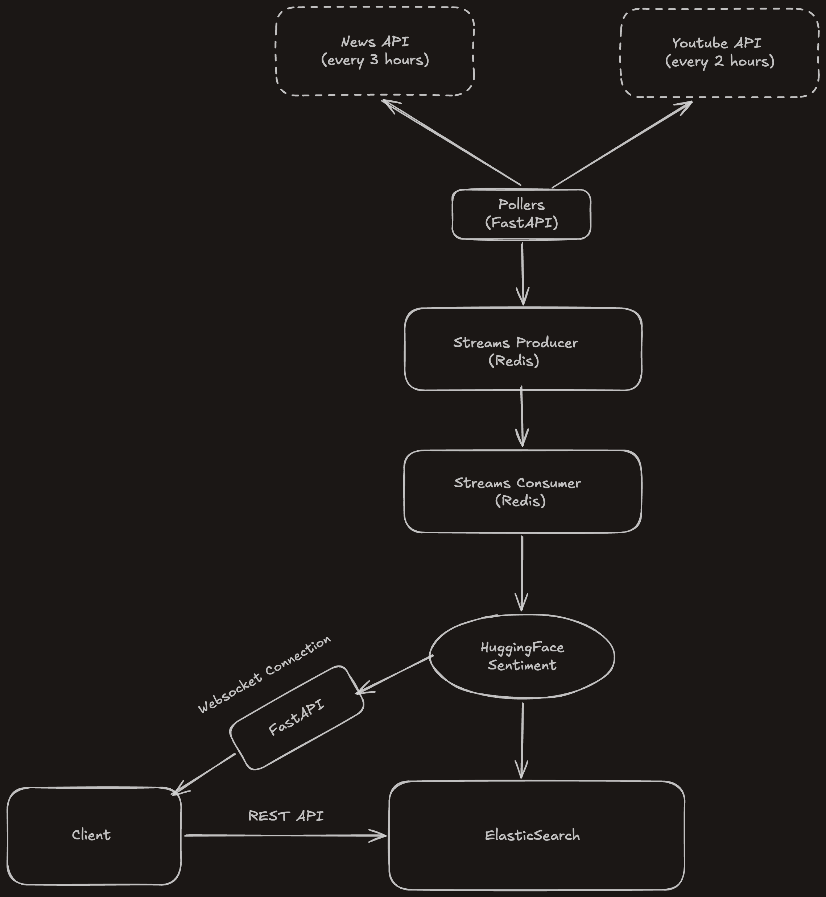

# Paramount Pulse

 A live listening social tool that tracks audience sentiments in real time by aggregating mentions, reviews, and reactions from various news articles and Youtube around Paramount Movies/TV show releases, allowing us to see what the different reactions are surrounding Paramount Releases. Reactions are then tunneled into a sentiment breakdown of Positive, Neutral, and Negative. 

## Phase 1 - Project Foundation

### 1.1

The main project directory is split into two folders, backend and frontend. the backend folder takes of the whole pipeline from Data ingestion to setting up the websockets whereas the frontend folders handles everything that the user sees. 

We also set up a docker compose file that defines each service as a container with its own build context (Redis and ElasticSearch being the exception because they use pre-built images). Docker compose also has a built-in name server. It puts all of the containers on the same network and lets them find each other by their service name. 

## Tech Stack

**Tech Stack:** FastAPI, Redis Streams, ElasticSearch, HuggingFace, React

>**React**: Utilized to create our dashboard which will render sentiment charts, filters, and live
feed. The FastAPI web-socket will push live updates to the React Frontend. 

>**FastAPI**: Act as background workers that poll Reddit/Youtube on schedule e.g. every 15 minutes. 

>**FastAPI**: Will also act as Web-socket, providing a persistent, two-way communication channel between our client and the server over a single, long-lived connection, sending data instantly at any time. 

>**Redis Streams**: Producer (your Reddit/YouTube pollers) will fetch a comment or post and push that as a raw event onto the Redis Stream. Redis just holds the queue of events in order. Nothing is processed here. Events sit there until something reads them. Acts as a failsafe handoff point. 

>**HuggingFace**:  Consumes events from the Redis stream and runs it through HuggingFace, Attaches the score and writes to ElasticSearch. 

>**ElasticSearch**: Acts as a high powered NoSQL Database that will allow us to query to answer questions like ‘*What's the sentiment breakdown for Mission Impossible 8 over the last 7 days?’.* It handles it handles full-text search, time-range queries.

>**Docker**: All of the services will be orchestrated via docker-compose.

## Features

- Sentiment Breakdown with ASCII bars
- Live Feed from Youtube/Various News Articles
- TMDB metadata panel (Movie Poster, Release Date, etc)

**Data Flow Diagram**
---

**Figma Designs**
---

